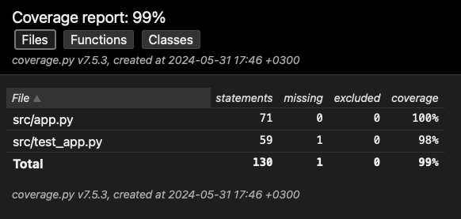

# test-task-risk-strategy
Тестовое задание на позицию разработчика риск-стратегий

---

В текущей версии доступно подключение через localhost по 8000 порту. ручку `/deposit-calc/` можно тригернуть через POST запрос, согласно условиям задания. 

TODO:

    - Сделать прокидывание портов в качестве аргумента при билде
    
    - Вынести константы, как параметры окружения


Если у Вас имеется уже установленный и запущенный движок Docker. Чтобы запустить сервис исполните команды ниже.


```bash
docker build . -t test-task
docker run -p 8000:8000 test-task
```

Далее для того, чтобы проверить работу сервиса можно обстрелять его через возможности, предоставленные fastApi.

 - http://localhost:8000/docs/

 ---
 ## Тестирование
  

Чтобы вручную проверить покрытие, запустите команду `./test.sh`

Отчет можно посмотреть в сгенерированных документах `htmlcov/index.html`.

Чтобы почистить весь мусор запустите `./clear`


